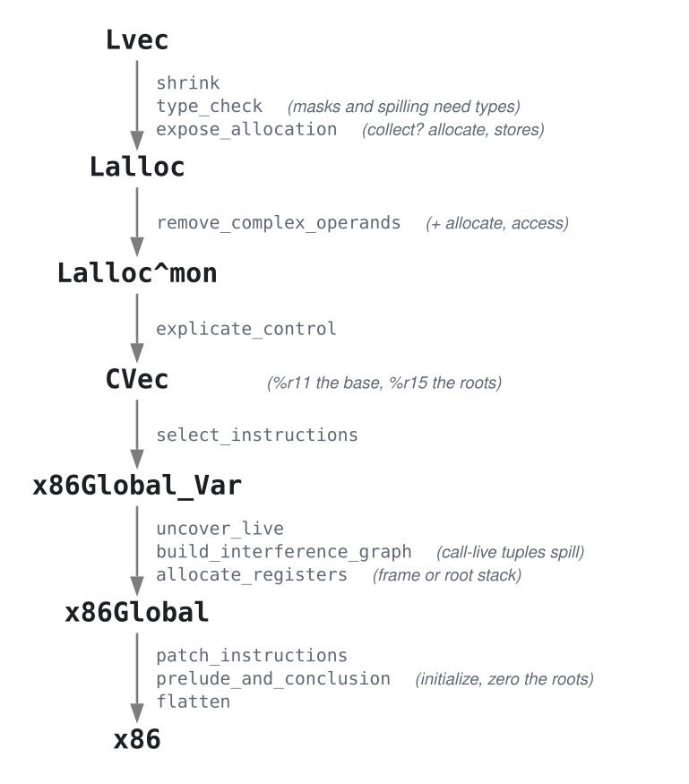

# Tuples and Garbage Collection

Marcin Benke, MIM UW

Compiler Construction --- lecture 7

## Roadmap

### Where we left off

So far we have covered: integers, booleans, control flow, registers,
functions.

Every value so far fits in a register, and every value's lifetime is
known statically --- a variable dies at the end of the block that
last reads it, a frame dies when its function returns.

### Lvec - what we are adding
(In the book, you will notice **Ltup**, but our language has functions).

```python
t = 40, True, (2,)
print(t[0] + t[2][0] if t[1] else 44)
```

tuple construction, element access, `is`, `len`.


Concrete syntax, on top of **Lfun**:

```
Type ::= ... | tuple[Type, ...]
exp  ::= ... | exp, ..., exp | exp[int] | len(exp)
cmp  ::= ... | is
```

From Python's `ast`, free as usual:

```
Tuple([exp, ...], Load())
Subscript(exp, Constant(int), Load())
Call(Name('len'), [exp])
Compare(exp, [Is()], [exp])
```

### What is actually new

Not the syntax. The *lifetime*.

```python
def f():
    x = 42, 43
    return x
    
t = f()
print(t[0])
```

`x` goes out of scope when `f` returns. The tuple does not.

A tuple cannot live in the frame, so it lives on the **heap**<br/>
--- and nothing in the language deletes it. From the programmer's viewpoint
tuples live forever.

### Two consequences

1. **The heap needs reclaiming.** Long-running programs would run out
   of memory. Nobody says when to free, so the *runtime* must decide:
   garbage collection.

2. **The collector must know what is a pointer.** It has to be
   able to look at a machine word and know whether following it is
   sensible. That is a demand the collector makes on the *compiler*.

We will talk about garbage collection in a moment.

### The pipeline



One new pass, one new prerequisite, and changes in the back end
concentrated where homes are chosen.

## The language


### Are tuples arrays? Structures?

Even though tuples look like arrays, there are more like structures<br/>
(with fields numbered rather then named)

- **the index is a constant.** `t[i]` for a computed `i` is out: the
  offset has to be known at compile time, and so does the element's
  *type*;
- **at most 50 elements**, because that is how wide the pointer mask used for GC
  will be;

In the basic version **tuples are immutable**

- allows to test using CPython `t[0] = x` is not Python.
- makes garbage collection easier

Mutability is an extension (requires a dedicated interpeter to test).

## Garbage collection

### The problem

Which tuples will be used again? Undecidable.

So collectors ar conservative: keep everything that *can* be reached.

- the **root set** --- every tuple address in a register or on the
  stack;
- the **live objects** --- everything reachable from the root set.

Everything else is garbage. Some garbage survives a collection; no
live object is ever reclaimed.

### Two-space copying

The heap is two halves: **FromSpace** and **ToSpace**.

- allocate by bumping a pointer through the FromSpace;
- when it will not fit, copy every live object to the ToSpace and
  swap the names.

Cost is proportional to the *live* data, not to the garbage.
Allocation is three instructions.<br/>
Compaction is free --- a side
effect of copying.

OTOH half of the memory is "wasted", but we will see how it can be improved.

### Cheney's algorithm

Breadth-first search, with the queue living in the ToSpace itself.

Two pointers into the ToSpace: **free** (back of the queue) and
**scan** (front).

1. copy everything directly reachable from the root set;
2. take the tuple at *scan*, copy anything it points at to *free* (advancing it),
   update its pointers, advance *scan*;
3. stop when *scan* catches up with *free*.

No auxiliary stack or queue --- the copied data *is* the queue.

### Forwarding pointers

The graph may be shared, so we must not copy a tuple twice.

``` python
x = (0,1)
y = (x,x)
```
When a tuple is copied, its **old** copy is overwritten with the
address of the new one --- a *forwarding pointer*. Anything arriving
later at the old address follows it instead of copying again.

That also makes cycles safe. A well-typed program cannot build one,
but the collector handles them anyway. 


## Data representation

### Telling pointers from integers

The collector sees 64-bit words. `42` and an address look alike.

Some ways out:

1. tag every value --- what dynamically typed languages do anyway;
2. keep pointers apart from non-pointers;
3. use the static types to generate maps of where the pointers are.
4. "if it looks like a pointer (range), and quacks like a pointer, call it a pointer"


We take (1) for the **heap** and (2) for the
**stack**.

Note:

- (3) is arguably the finest solution, but also the most difficult (GHC uses it)
- (4) is often fine with some approaches, but not applicable with the copying GC (in general all with all pointer-altering ones).

### The tag

Every tuple carries one extra 64-bit word in front of it:

```
 63       57 56                        7 6      1 0
+-----------+---------------------------+--------+-+
|  unused   |       pointer mask        | length |1|
+-----------+---------------------------+--------+-+
```

- **bit 0** --- 1 while the tuple has not been copied. When it is 0,
  the whole word is a forwarding pointer. (Addresses are 8-byte
  aligned, so their low bits are free.)
- **bits 1--6** --- the length. Six bits; hence 50 elements.
- **bits 7--56** --- the pointer mask: bit *i* is 1 if element *i* is
  itself (a pointer to) a tuple.

```python
tag = 1 | (len << 1) | (mask << 7)
```

`tuple[int]` gives `3`; `tuple[tuple[int]]` gives `131`.

### The root stack

Pointers in registers and frames are the other half of the problem,
and there we use separation instead of tagging.

A second stack --- the **root stack**, or shadow stack --- holds
nothing but pointers. `%r15` points at its top.

Rules:

- a tuple-typed variable that has to be spilled is spilled **there**,
  not to the frame;
- a tuple-typed variable live across a call to the collector **must**
  be spilled, so that no pointer is hiding in a register.

Then the collector's job is easy: walk the root stack, and inside each
tuple follow the mask.

### The runtime interface

```c
void initialize(uint64_t rootstack_size, uint64_t heap_size);
void collect(int64_t** rootstack_ptr, uint64_t bytes_requested);

int64_t*  free_ptr;
int64_t*  fromspace_begin;
int64_t*  fromspace_end;
int64_t** rootstack_begin;
```

`initialize` makes both spaces and the root stack, once, in `main`.

`collect` takes the top of the root stack and how many bytes are
wanted, and returns with that much room available.

Between collections the compiler allocates by itself, by moving
`free_ptr` --- no call, three instructions.

## What the compiler must do

### Why we need a type checker now

The tag needs a pointer mask: *which elements of this tuple are
pointers*;<br/>
the register allocator needs to know *which variables are
tuple-typed* (becausee they are spilled to the root-stack)

Neither question can be answered by looking at the value at runtime<br/>
(we are not tagging integers - that would be cumbersome and inefficient)<br>
Both are questions about **types**.

We need a small type checker: `int`, `bool`, `tuple[...]`, `Callable[...]` (for functions).<br/>
No type inference is needed as types of all function parameters are declared.

Note that tuples without GC can be implemented without a type checker
--- there is no need for root stack then.<br/>
It is nice to have anyway - avoid things like `x = 1; print(x[2])`

### Expose allocation and *Lalloc*

To make memory handling for tuples explicit, we introduce an intermediate language **Lalloc**<br/>
- essentially **Lvec** extended with some internal forms:

```
exp ::= GlobalValue(var) | Allocate(int, type) | Begin(stmt∗ , exp)
stmt ::= Collect(int) | Assign([Subscript(exp,int,Store())], exp)
```
- `Allocate` handles memory allocation;
- `Collect` is called when a GC is needed;
- `GlobalValue(name)` reads the value of a global variable, such as `free_ptr`
- `Begin(stmt*, exp)` (introduce temporary variables) - we have already seen when discussong conditionals;

We also add a nanopass handling the translation: `expose_allocation`.

### expose_allocation

This new pass rewrites tuple creation into
the pieces the back end can actually emit:

```python
(e0, ..., e(n-1))
```
⟹
```python
begin:
    x0 = e0
    ...
    x(n-1) = e(n-1)
    if free_ptr + bytes < fromspace_end:
        pass
    else:
        collect(bytes)
    v = allocate(n, type)
    v[0] = x0
    ...
    v[n-1] = x(n-1)
    v
```

where *bytes* is `8 * (n + 1)` --- the elements plus the tag.

### Reading that translation

Four things are happening, in an order that is not negotiable:

1. **evaluate the elements first.** Any of them may allocate, and so
   may collect. 
2. **ask whether there is room**, and call `collect` if not. 
3. **allocate** --- reserve the space, write the tag.
4. **initialise** the elements.


Initializing `e0, ..., e(n-1)` before *allocate* is important.<br/>
An allocated but uninitialised tuple must never be
visible to the collector --- it might follow imaginary "pointers" in it.


### select_instructions: allocate and collect

Allocation, inline --- no call, three instructions and a store:

```att
lhs = allocate(len, type)
⟹
    movq free_ptr(%rip), %r11
    addq $8(len+1), free_ptr(%rip)
    movq $tag, 0(%r11)
    movq %r11, lhs
```

Collection, a call:

```att
collect(bytes)
⟹
    movq %r15, %rdi
    movq $bytes, %rsi
    callq collect
```

### select_instructions: element access

Both are one `movq` through a base register, with `+1` to step over
the tag:

```att
lhs = tup[n]
⟹
    movq tup, %r11
    movq 8(n+1)(%r11), lhs

tup[n] = rhs
⟹
    movq tup, %r11
    movq rhs, 8(n+1)(%r11)
```

### Why %r11, and not %rax

An offset needs its base in a *register*, and `tup` may well be in
memory. So it is copied to a register first --- and that register is
reserved, not allocated.

Suppose it were `%rax`, and `rhs` were spilled. `patch_instructions`
repairs a memory-to-memory move through `%rax`:

```att
    movq tup, %rax
    movq rhs, %rax
    movq %rax, 8(%rax)
```

Two values, one register. `%r11` is reserved precisely so this cannot
happen --- and `%r15` likewise, for the root stack.

Both were already in `reserved_registers`; this is the lecture that
says why.

### Register allocation

The allocator gains one job: **respect the root stack**.

Two halves, each small:

- **spill tuple-typed variables to root stack (addressed via `%r15)`**, not call stack (`%rbp`).
A decision  about *homes*, taken after colouring;
- **force call-live tuple variables to spill at all.** They already
  interfere with the caller-saved registers; add edges to the
  callee-saved ones too, and no register is left.

The colouring itself does not change.

### Prelude and conclusion

Add these to prelude and conclusion of every function

```att
    movq $0, <each root slot this function will use>
    addq $<8 * root spills>, %r15
    ...
    subq $<the same>, %r15
```

Initialising root stack slots is necessary to prevent GC from following phantom "pointers"
that may remain there.

The root stack grows **up**; a function's slots are below the pointer
it hands to `collect`.

`main` does two things more in the prelude:

```att
    movq $65536, %rdi                  # rootstack size
    movq $65536, %rsi                  # heap size
    callq initialize                   # sets rootstack_begin and free_ptr
    movq rootstack_begin(%rip), %r15
```

### Generational garbage collection
Hewitt, 1987:

- most objects die young
- if an object survives T , it will likely live long
- new objects contain pointers to old ones more often than conversely

Idea:

- A “nursery” for young objects with copying GC
(minor collection)
- The nursery is small and contains mostly garbage
(objects die young)
- If the copying GC leaves too little space, move objects to “mature” space

Needs special treatment of pointers from old to young objects.
(not a problem if objects are immutable)

## Mutability?
### Aliasing

```python
t1 = 3, 7
t2 = t1
t3 = 3, 7
print(42 if (t1 is t2) and not (t1 is t3) else 0)
```

A tuple value **is an address**. Assignment copies the address, so
`t1` and `t2` are two names for one tuple; `t3` is a different tuple
with equal elements.

`is` compares addresses --- which is why it is one `cmpq`.

### What immutability buys

Aliasing is where mutation would become visible: with `t[0] = x`,
writing through `t2` changes what `t1` reads. Without it, aliasing is
**unobservable** --- sharing and copying mean the same thing, so the
compiler may share freely.

The collector gets more than that.

- **The heap graph is acyclic**, and in creation order: an object can
  only point at objects that already existed.
- **No old object ever points at a young one.** That is the whole
  difficulty of generational collection, and immutability deletes it:
  no write barrier, no remembered set.


### What rules out cycles is the type system

Careful with the first of those. Even *with* mutation, a cycle needs a
tuple that contains itself (perhaps indirectly):

```python
t[0] = t
```

and that needs `t : tuple[tuple[tuple[...]]]` --- an infinite type. A
monomorphic type system cannot write it, so a well-typed program
cannot build a cycle whether tuples are mutable or not.

Cycles arrive with **dynamic typing**. We use
forwarding pointers and handle them anyway: in Cheney's algorithm it
is free, and we would rather not revisit the collector.


## Wrapping up

### Summary

- **Tuples live on the heap** because their lifetime is not the
  frame's. Nothing frees them, so the runtime collects them.
- **A copying collector** costs time proportional to live data,
  compacts for free, and makes allocation three instructions.
- **The collector must be told where the pointers are** --- the tag
  inside a tuple, the root stack outside it.
- **That is what forces a type checker.** The pointer mask and the
  spilling rule are both questions about types.
- **`expose_allocation`** turns one tuple literal into a conditional
  collection, an allocation and *n* stores --- in that order.
- **It pays for itself downstream**: because it emits only forms we
  already had, `explicate_control` is untouched --- including for
  `if t[0]:`, which lecture 4's last case already covers.
- **`%r11` and `%r15` are reserved**, and now we know why.

Next time: functions again --- as values, with tail calls that do not
grow the stack, and with more than six arguments, which is what the
tuples we just built were needed for.

## Questions?

### Lab tasks --- in three parts

This one is optional, and it comes in three pieces. **The first is
much smaller than this lecture makes it look.**

| | | needs |
|---|---|---|
| **1** | tuples, no collector | no type checker, no root stack |
| **2** | + the collector | both, and the mask |
| **3** | + `t[0] = x` | a different oracle |

Do 1 first and stop there if you like: it is a working `Lvec`
compiler that happens to leak.

### Part 1 --- tuples that leak

With no collector there is no room check, so no `if` --- and
therefore no new blocks, no root stack, and **register allocation
does not change at all**.

1. A heap in `runtime.c`: a big buffer and a `free_ptr` that only
   goes up.
2. `expose_allocation`: elements, `allocate`, stores. Check the dump
   for `v1 = (42,)` --- and check there is no `if` in it.
3. RCO and the ANF check for the new forms. Remember `len`, and
   remember that RCO must now read a `Begin`.
4. `select_instructions`: `allocate` (a tag with just the length),
   element read, `is`, `len`.
5. End to end. Nothing else should need touching --- if it does,
   something in part 1 is doing more than it should.

### Part 2 --- add the collector

Now the pointer mask is needed, and so, finally, is a type checker.

6. A type checker for `Lvec`: `int`, `bool`, `tuple[...]`,
   `Callable[...]`. Record each `Tuple` node's type and each
   variable's.
7. The mask in the tag; `collect`, and the conditional in
   `expose_allocation` that calls it. Block count now grows.
8. Prelude and conclusion: `initialize` in `main`, root frames
   everywhere, zeroing.
9. **End to end with everything spilled** --- the place to get the
   suite green, before the allocator has a say.
10. Root-stack spilling in the allocator, and the interference edges
    that force it.
11. A test that allocates in a loop, with a heap small enough that it
    really collects.

### Part 3 --- add mutation

12. `t[0] = x` in the source. The instruction sequence already
    exists: `expose_allocation` has been emitting stores since part 1.
    What has to change is the **oracle** --- CPython cannot run a
    program that writes to a tuple, so those tests compare against an
    interpreter instead.

### Stretch goals

- **Where does the time go?** Count collections and bytes copied;
  plot against heap size.
- **Generational collection** --- most tuples die young, so collect
  the young ones more often.
- **Arrays**: same tag, but the length is not known at compile time,
  and neither is the index. What breaks?

## Extra material

### What we did not do

| omitted | consequence |
|---|---|
| a precise stack map | the root stack costs a second spill area and its zeroing |
| generational collection | every collection touches all live data |
| arbitrary tuple sizes | 50 elements, one word of mask |
| mutation | records cannot be updated in place; arrays are where it belongs |

### Further reading

- Cheney (1970), *A Nonrecursive List Compacting Algorithm* --- two
  pages, and the whole of our collector.
- Jones, Hosking, Moss, *The Garbage Collection Handbook* --- the
  standard reference; chapters 2--4 cover what we did.
- Appel (1987), *Garbage Collection Can Be Faster Than Stack
  Allocation* --- the argument for copying collectors, from cost
  proportional to live data.
- Wilson (1992), *Uniprocessor Garbage Collection Techniques* --- the
  survey that names the design space.

## Implementation hints

### The type checker is the prerequisite

Write it first, and run it right after `shrink` --- `main` exists by
then and `and`/`or` are gone.

It produces two things the later passes need, and neither is
recoverable afterwards:

```python
node.has_type          # on every Tuple node: for the pointer mask
self.var_types[name]   # per function: for the spilling rule
```

There is no inference to do --- but `shrink` currently *discards* the
annotations, so the first job is to carry them: `FunDef` gains
parameter and return types, and a missing annotation becomes an
error rather than being ignored.

`ast` gives you `tuple[int, bool]` as a `Subscript` of a `Name`, so
write a small `parse_type` and keep types as your own dataclasses,
not as `ast` nodes.

### Computing the tag

```python
def tuple_tag(self, ty: TupleType) -> int:
    mask = 0
    for i, element in enumerate(ty.elements):
        if isinstance(element, TupleType):
            mask |= 1 << i
    return 1 | (len(ty.elements) << 1) | (mask << 7)
```

Two values to test it against: `tuple[int]` is `3`, and
`tuple[tuple[int]]` is `131`.

Reject more than 50 elements here, with a message --- it is the only
place that knows.

### expose_allocation, in one piece

```python
def expose_tuple(self, node):
    n = len(node.elts)
    size = 8 * (n + 1)
    xs = [self.fresh_temp() for _ in node.elts]
    v = self.fresh_temp()

    room = Compare(BinOp(GlobalValue('free_ptr'), Add(),
                         Constant(size)),
                   [Lt()], [GlobalValue('fromspace_end')])

    body = [Assign([x], self.visit(e))
            for x, e in zip(xs, node.elts)]
    body.append(If(room, [Pass()], [Collect(size)]))
    body.append(Assign([v], Allocate(n, node.has_type)))
    body += [Assign([Subscript(v, Constant(i), Store())], x)
             for i, x in enumerate(xs)]
    return Begin(body, v)
```

`self.visit(e)` on the elements, not `e`: they may be tuples
themselves.

### Where the new nodes live

`GlobalValue`, `Allocate` and `Collect` are ours, so put them beside
`Begin` and `Goto` --- a `cvec.py` --- and give each a `__str__`.
`-vv` is most of the debugging in this stage.

`Subscript` is `ast`'s, and its `ctx` matters: `Load()` when reading,
`Store()` when it is the target of an assignment. Match on it, or
reading and writing look the same.

### remove_complex_operands

- `allocate`, `begin` and element access are **complex**;
- the operands of element access must be **atoms** --- both of them,
  including the index, and including the two in a store's target;
- `global_value` is an **atom** --- it becomes one `movq` from a
  fixed address;
- `collect` is a statement and has no operands to speak of.

The `ANFChecker` needs a case for each; the ones with no `_fields`
need an explicit `visit_`, or `generic_visit` walks straight past
them.

### RCO now has to read a Begin

The case that catches people, because it is not about tuples at all.

Until now `Begin` was something `remove_complex_operands`
**produced** --- for a branch's temporaries, for a `while` test. Now
`expose_allocation` hands it one, so it must also **consume** one.

And the statements inside cannot be hoisted out as temporaries:

```python
t.0[0] = init.1
```

A temporaries list holds `(Name, expr)` pairs. A store is not an
assignment to a name, so it will not fit. The `Begin` stays, and
`explicate_assign` --- which has handled `Begin` since lecture 4 ---
takes it apart later.

### len is not a function call

```python
case Call(Name('len'), [tup]):
```

must be matched **before** the general `Call` case, exactly like
`input_int` and `print`. Miss it and `len` is looked up in the table
of the program's own functions, and rejected as undefined --- a
confusing error a long way from the cause.

### The homes are no longer a function of the colour

Until now, colour *k* meant one home. With two spill areas it means
one of two:

```python
def color_to_home(self, base, color, is_tuple):
    if color < len(register_pool):
        return Reg(register_pool[color])
    if is_tuple:
        return Deref('r15', -8 * self.root_slot(color))
    return Deref('rbp', -8 * self.frame_slot(color) - base)
```

Two independent counters, each memoised on the colour, so that two
variables sharing a colour still share a home. A tuple variable and
an integer variable *may* share a colour --- they simply do not
interfere --- and then they get different homes, one on each stack.

### The interference edges that force the spill

```python
case x86.Callq():
    for u in live_after:
        if isinstance(u, Variable):
            for r in caller_saved_regs:
                add_edge(x86.Reg(r), u)
            if self.is_tuple_var(u):
                for r in callee_saved_regs:
                    add_edge(x86.Reg(r), u)
```

Every call, not just `callq collect`: the callee may allocate, and
then it collects on our behalf.

`%rsp`, `%rbp` and `%r15` are in `callee_saved_regs` but never
handed out, so the extra edges to them cost nothing.

### Watch the patch rules

A store whose value got spilled has two memory operands, and comes
out of the patch pass like this:

```att
    movq -16(%rbp), %r11      # the pointer
    movq -8(%rbp), %rax       # the value, routed through %rax
    movq %rax, 8(%r11)
```

Which is exactly the argument for `%r11`, now visible: had the
pointer been in `%rax`, the second line would have loaded the value
on top of it and the third would have written through a number.

So: check that your patch pass has not been taught to use `%r11` for
anything. The quickest way to see all of this is to compile with
every variable spilled.

`addq $16, free_ptr(%rip)` is an immediate and a memory operand:
legal, and no rule should touch it.

### Testing

Tuple programs are valid Python, so the differential oracle is
unchanged --- CPython runs each test and we compare what it prints.
Two wrinkles:

- **only integers print**, so end every test in `print(<an int>)`;
- **the default heap is far too big to collect**. Make the two sizes
  a compiler flag, default them small in the test suite, and write a
  test that allocates in a loop far past the heap size, keeping some
  of it live and printing it afterwards.

The second is the only test that exercises the collector at all. Add
a counter to `collect` and assert it fired.

### Suggested order

Follow the three parts of the lab, and resist starting with the type
checker: **nothing in part 1 needs it.** The mask and the spilling
rule are the only things that do, and both belong to the collector.

Within part 2, the one order that matters:

- prelude and conclusion, with **every variable spilled** ---
  tuple-typed ones to the root stack, everything else to the frame.
  That is already a correct collecting compiler, and the suite should
  be green *there*, before register allocation gets a say;
- then the two spill areas and the new edges;
- then the collector-stressing test.

Getting the suite green twice --- once at the end of part 1, once
before the allocator --- is what keeps a garbage-collection bug from
arriving at the same time as an allocation bug.
